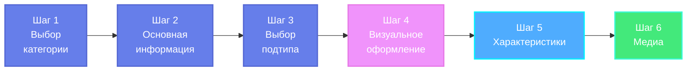

# Дерево создания профилей - Mermaid диаграмма

```mermaid
graph TB
    CENTER["🎯 СОЗДАНИЕ ПРОФИЛЯ<br/>Wizard System<br/><small>Стандартизированный процесс</small>"]
    
    CENTER --> VENUE["🏢 ПЛОЩАДКА<br/>6 шагов • 6 подтипов"]
    CENTER --> ANIMATOR["👤 АНИМАТОР<br/>6 шагов"]
    CENTER --> SHOW["🎪 ШОУ-ПРОГРАММА<br/>6 шагов • 7 подтипов"]
    CENTER --> AGENCY["🏢 АГЕНТСТВО<br/>6 шагов"]
    CENTER --> QUEST["🎯 КВЕСТ<br/>6 шагов • 2 подтипа"]
    CENTER --> MASTERCLASS["🎨 МАСТЕР-КЛАСС<br/>6 шагов • 4 подтипа"]
    CENTER --> PHOTO["📷 ФОТО/ВИДЕО<br/>6 шагов • 3 варианта"]
    
    %% ПЛОЩАДКА
    VENUE --> VENUE1["Детский центр<br/>• Параметры<br/>• Удобства детские<br/>• Правила<br/>• Услуги"]
    VENUE --> VENUE2["Лофт / Студия<br/>• Параметры<br/>• Удобства студийные<br/>• Правила<br/>• Декор"]
    VENUE --> VENUE3["Кафе / Ресторан<br/>• Параметры<br/>• Удобства ресторанные<br/>• Правила<br/>• Банкет"]
    VENUE --> VENUE4["Парк развлечений<br/>• Параметры<br/>• Аттракционы<br/>• Правила"]
    VENUE --> VENUE5["Открытая площадка<br/>• Параметры<br/>• Удобства outdoor<br/>• Правила<br/>• Навесы"]
    VENUE --> VENUE6["Другое<br/>• Параметры<br/>• Базовые удобства"]
    
    %% АНИМАТОР
    ANIMATOR --> ANIM1["Специализация<br/>• Типы персонажей<br/>• Возрастные группы<br/>• Типы мероприятий"]
    ANIMATOR --> ANIM2["Опыт и навыки<br/>• Опыт работы<br/>• Навыки<br/>• Доп. услуги"]
    ANIMATOR --> ANIM3["Медиа<br/>• Фото костюмов (3+)<br/>• Видео с мероприятий"]
    
    %% ШОУ
    SHOW --> SHOW1["Мыльные пузыри<br/>• Параметры<br/>• Программа<br/>• Оборудование"]
    SHOW --> SHOW2["Научное шоу<br/>• Параметры<br/>• Опыты<br/>• Безопасность ⚠️"]
    SHOW --> SHOW3["Фокусы<br/>• Параметры<br/>• Типы фокусов<br/>• Оборудование"]
    SHOW --> SHOW4["Животные<br/>• Параметры<br/>• Типы животных<br/>• Справки ⚠️"]
    SHOW --> SHOW5["Криошоу<br/>• Параметры<br/>• Опыты<br/>• Сертификаты ⚠️"]
    SHOW --> SHOW6["Световое шоу<br/>• Параметры<br/>• Тип шоу<br/>• Оборудование"]
    SHOW --> SHOW7["Пенная вечеринка<br/>• Параметры<br/>• Оборудование<br/>• Требования"]
    
    %% АГЕНТСТВО
    AGENCY --> AGENCY1["Специализация<br/>• Направления<br/>• Типы мероприятий"]
    AGENCY --> AGENCY2["О компании<br/>• Опыт<br/>• Сотрудники<br/>• Мероприятия"]
    AGENCY --> AGENCY3["Преимущества<br/>• Гарантии<br/>• Комплекс услуг"]
    AGENCY --> AGENCY4["Медиа<br/>• Портфолио (10+ фото)"]
    
    %% КВЕСТ
    QUEST --> QUEST1["На локации<br/>• Адрес локации<br/>• Типы квестов<br/>• Удобства"]
    QUEST --> QUEST2["Выездной<br/>• Типы квестов<br/>• Что привозим<br/>• Требования"]
    
    %% МАСТЕР-КЛАСС
    MASTERCLASS --> MC1["Творческий<br/>• Программа<br/>• Материалы<br/>• Требования"]
    MASTERCLASS --> MC2["Кулинарный<br/>• Программа<br/>• Материалы<br/>• Требования"]
    MASTERCLASS --> MC3["Научный<br/>• Программа<br/>• Материалы<br/>• Требования"]
    MASTERCLASS --> MC4["Ремесленный<br/>• Программа<br/>• Материалы<br/>• Требования"]
    
    %% ФОТО/ВИДЕО
    PHOTO --> PHOTO1["Только фото<br/>• Типы съемок<br/>• Услуги<br/>• Портфолио (10+)"]
    PHOTO --> PHOTO2["Только видео<br/>• Типы съемок<br/>• Услуги<br/>• Портфолио (3+)"]
    PHOTO --> PHOTO3["Фото и видео<br/>• Типы съемок<br/>• Услуги<br/>• Портфолио"]
    
    %% Стили
    classDef centerNode fill:#ff6b6b,stroke:#ee5a6f,stroke-width:3px,color:#fff
    classDef venue fill:#4ecdc4,stroke:#45b7b8,stroke-width:2px,color:#fff
    classDef animator fill:#95e1d3,stroke:#7dd3c4,stroke-width:2px,color:#fff
    classDef show fill:#f38181,stroke:#f06d6d,stroke-width:2px,color:#fff
    classDef agency fill:#aa96da,stroke:#9674c4,stroke-width:2px,color:#fff
    classDef quest fill:#fcbad3,stroke:#f9a8c4,stroke-width:2px,color:#fff
    classDef masterclass fill:#ffd3a5,stroke:#ffc085,stroke-width:2px,color:#fff
    classDef photo fill:#a8e6cf,stroke:#85d4b4,stroke-width:2px,color:#fff
    
    class CENTER centerNode
    class VENUE,VENUE1,VENUE2,VENUE3,VENUE4,VENUE5,VENUE6 venue
    class ANIMATOR,ANIM1,ANIM2,ANIM3 animator
    class SHOW,SHOW1,SHOW2,SHOW3,SHOW4,SHOW5,SHOW6,SHOW7 show
    class AGENCY,AGENCY1,AGENCY2,AGENCY3,AGENCY4 agency
    class QUEST,QUEST1,QUEST2 quest
    class MASTERCLASS,MC1,MC2,MC3,MC4 masterclass
    class PHOTO,PHOTO1,PHOTO2,PHOTO3 photo
```

## Общая структура шагов

## Легенда

- ✅ **Обязательные блоки** - отмечены зеленым
- ⚠️ **Требуют дополнительных документов** - отмечены предупреждением
- 🔵 **Основная категория** - большой блок с иконкой
- 🟢 **Подтип** - средний блок
- 🟡 **Детальный блок** - маленький блок с описанием

## Как использовать

1. **В GitHub** - диаграмма отобразится автоматически при просмотре файла
2. **В VS Code** - установите расширение "Markdown Preview Mermaid Support"
3. **Онлайн** - скопируйте код в [Mermaid Live Editor](https://mermaid.live/)
4. **Экспорт** - в Mermaid Live Editor можно экспортировать в PNG/SVG

